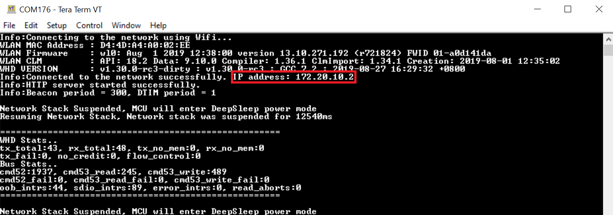
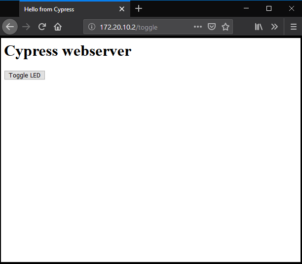

## WLAN Low-Power

This code example demonstrates low power operation of the Host MCU and the WLAN device. The example connects to a network whose credentials are provided in *mbed_app.json*. After connecting to the network successfully, the example starts an HTTP server. The example configures the WLAN device in the specified powersave mode and sets the host MCU in an extended wait state, waiting for HTTP requests. The host MCU is in Deep Sleep or Sleep mode during extended wait state.


### Requirements

- [ModusToolbox™ IDE](https://www.cypress.com/products/modustoolbox-software-environment) v 2.0  
Programming Language: C

- [Mbed CLI](https://github.com/ARMmbed/mbed-cli)  
Programming Language: C++

- Associated Parts: All [PSoC® 6 MCU](http://www.cypress.com/PSoC6) parts

### Supported Kits

- [PSoC 6 WiFi-BT Prototyping Kit](https://www.cypress.com/CY8CPROTO-062-4343W) (CY8CPROTO-062-4343W)  
- [PSoC 6 WiFi-BT Pioneer Kit](https://www.cypress.com/cy8ckit-062-wifi-bt) (CY8CKIT-062-WiFi-BT)  
- [PSoC 62S2 WiFi-BT Pioneer Kit](https://www.cypress.com/cy8ckit-062s2-43012) (CY8CKIT-062S2-43012)  

### Hardware Setup

This example uses the kit’s default configuration. See the kit guide to ensure the kit is configured correctly.

**Note**: The PSoC 6 BLE Pioneer kit and the PSoC 6 WiFi-BT Pioneer kit ship with KitProg2 installed. Before using this code example, make sure that the kit is upgraded to KitProg3. The tool and instructions are available in the [Firmware Loader](https://github.com/cypresssemiconductorco/Firmware-loader) GitHub repository. If you do not upgrade, you will see an error like “unable to find CMSIS-DAP device” or “KitProg firmware is out of date”.

For Mbed OS, the kit must be in DAPLink mode. See the *KitProg3 User Guide* (found in the **Documentation** tab in the [Cypress Programming Solutions](https://www.cypress.com/products/psoc-programming-solutions) web page) for details of how to put the Pioneer Kit into DAPLINK mode.

### Software Setup

This example uses a terminal emulator. The instructions use [Tera Term](https://ttssh2.osdn.jp/index.html.en).

This example requires no additional software or tools.

### Using the Code Example in Mbed CLI Tools

Mbed CLI commands are used to import the code example and compile. See [Working with Mbed CLI web page](https://os.mbed.com/docs/mbed-os/v5.14/tools/working-with-mbed-cli.html).

1. Import the code example into your Mbed OS directory using the following command:
    ```
    mbed import https://github.com/cypresssemiconductorco/mbed-os-example-wlan-lowpower
    ```

2. Change working directory to the code example folder.
    ```
    cd mbed-os-example-wlan-lowpower
    ```
3. Open *mbed_app.json* and edit the Wi-Fi SSID and password to match your AP settings.

4. Connect the board to your PC using the provided USB cable through the USB connector.

5. To allow programming from Mbed CLI, the kit must be in DAPLink mode. See [Firmware-loader](https://github.com/cypresssemiconductorco/Firmware-loader) for more information on how to update the firmware and switch to DAPLink mode.

6. Compile the code and program the target board.
    ```
    mbed compile -m \<TARGET\> -t \<TOOLCHAIN\> --flash --sterm --baudrate 115200
    ```
    For example, to build for the target CY8CKIT_062S2_43012 with GCC_ARM toolchain, use the following command:
    ```
    mbed compile -m CY8CKIT_062S2_43012 -t GCC_ARM --flash --sterm --baudrate 115200
    ```
**Note:** The *--sterm* option opens the serial terminal with 9600-8N1 setting on the command prompt itself after programming completes. Do not use this option if you wish to connect using another serial terminal application.

### Operation

  1. Open a serial terminal application like Tera Term. Set the baud rate to 115200. When the device connects to an access point (AP) and starts an HTTP server successfully, it displays the IP address of the device as shown in [Figure 1](#figure-1-serial-terminal-output).

  ##### Figure 1. Serial Terminal Output



  2. Open a browser on a PC connected to the same network as the device.

  3. Enter http://<ip_address>/ in the search window to issue an HTTP GET request. The device responds by displaying a page with an option to toggle an LED, as shown in [Figure 2](#figure-2-http-server-webpage). 

  ##### Figure 2. HTTP Server Webpage


  4. When you click the button, it sends an HTTP POST request to the device. The device toggles the state of the LED on receiving the HTTP POST request.

  5. Alternatively, you can use `cURL` to issue HTTP requests. 

     An example command for a GET request is:  

     ```
     curl -v -X GET "http://<ip_address>/"
     ```

     An example command for a POST request is:

     ```
     curl -v -X POST "http:// <ip_address>/toggle/"
     ```

### Making current measurements
#### CY8CKIT_062S2_43012 
1. You can measure current for PSoC 6 at J15 across VTARG and P6_VDD. Ensure that J25 is removed this eliminates leakage currents across potentiometer R1. 
2. For the CYW43012 device, you can measure current at supplies' VDDIO_WL used for SDIO communication interface, and at VBAT used for powering CYW43012. 
3. You can measure the current for the CYW43012 device at VBAT across VBAT and VCC_VBAT at J8. 
4. You can measure the current for CYW43012 at VDDIO_WL across VDDIO_WL and VCC_VDDIO2 at J17.

#### CY8CPROTO_062_4343W
1. You can measure current for PSoC 6 by removing R65, found on the right side of the board close to the USB connector of PSoC 6 USB (device), and connecting an ammeter between VTARG (J2.32) and P6_VDD (J2.24). 
2. The PSoC 6 Deep Sleep current is around 350 uA because of a pull-up resistor, R24, attached to WL_HOST_WAKE pin P0_4, which leaks around 330 uA because P0_4 is driven LOW when there is no network activity. So, remove R24, found at the back of the board, below J1.9. 
3. For the CYW4343W device, you can measure the current at supplies’ VDDIO_1LV used for SDIO communication interface, and at VBAT1 and VBAT2 used for powering CYW4343W. VBAT1 and VABT2 are shorted to each other. 
4. You can measure at VBAT1 or VBAT2 by removing R87. R87 is on the back of the board, towards the right and above J2.33. Connect an ammeter between the pads of R87 to measure. 
5. You can measure current at VDDIO_1LV by removing the resistor R86, which is also on the back of the board, below J1.27. Connect an ammeter between the pads of R86 to measure. 
6. Note that the current at VDDIO_1LV will depend on the SDIO transactions that happen because of pull-up resistors on the lines to VDDIO_1LV. Also, VDDIO_1LV (named VDDIO_1DX in carrier module CY8CMOD_062_4343W schematic) will allow a current of 38 uA through R24 because WL_HOST_WAKE is LOW. This current needs to be deducted from the observed value of VDDIO_1LV.


#### CY8CKIT_062_WIFI_BT 
1. You can measure current for PSoC 6 by connect an ammeter to the PWR MON jumper J8. 
2. For the CYW4343W device, you can measure current at supplies’ WL_VDDIO used for SDIO communication interface, and at WL_VBAT used for powering CYW4343W. 
3. You can measure current at WL_VBAT by removing L3, found along the right edge of the board close to the CYW4343W module, and connecting an ammeter between the pats of L3. 
4. You can measure the current at WL_VDDIO by removing L7, found on the top left corner on the back of the board, and connecting an ammeter between the pads of L7.

### Design and Implementation

The application initiates a connection to an AP whose credentials are provided in *mbed_app.json*. After successfully connecting to an AP, the application starts an HTTP server. The IP address of the device is printed on the serial terminal. The HTTP port address used in this application is 80. The application responds to requests with URLs which are stored in a page database. On receiving an HTTP request with “/toggle” as a parameter, the device toggles the LED.

After starting the HTTP server, the host MCU enters an extended wait state. In the extended wait state, if Deep Sleep is not locked, the Host MCU enters Deep Sleep, else it enters the Sleep state. The `mbedos sleep_manager` handles the sleep transition in the wait state. Mbed OS uses LwIP network stack, which runs multiple network timers for various network related activities. These timers need to be serviced by the host MCU. As a result, the host MCU will not be able to stay in Sleep or Deep Sleep state longer. During the extended wait state, the stack is suspended when the network is inactive to reduce the overall system current consumption. The application uses two macros, `INACTIVE_INTERVAL_MS` and `INACTIVE_WINDOW_MS`, to help decide if the network is inactive. The network is monitored for inactivity in an interval of length `INACTIVE_INTERVAL_MS` . If the network is inactive for a continuous duration specified by `INACTIVE_WINDOW_MS`, the network stack will be suspended until there is network activity.

On the other hand, the WLAN device is configured in a Power-save mode; Power-save with Poll or Power-save without Poll. The WLAN device wakes at every DTIM interval to receive beacon frames from the AP. The Power-save mode can be set through the macro `POWERSAVE_SELECT`.

For more information on low-power system design, see [AN227910](http://www.cypress.com/AN227910).

**Note:**
- The code example disables the default device configuration provided in `mbed-os\targets\TARGET_Cypress\TARGET_PSOC6\TARGET\COMPONENT_BSP_DESIGN_MODUS` with the one provided in `TARGET/CUSTOM_BSP_DESIGN_MODUS`. The custom configuration disables the Phase-locked Loop (PLL), disables HF clock to unused peripherals like audio/USB, and configures the Buck instead of Low Dropout (LDO) regulator to power the PSoC 6 device. This configuration reduces the current consumed by the PSoC 6 in Active state with a small increase in Deep Sleep current. Please enable the peripherals using `device-configurator` if you are using them. The `device-configurator` is bundled with the ModusToobox 2.0 installation and can be found at *\<ModusToolbox_installed_location>/tools_\*.\*/device-configurator*.
- If the device disconnects from the AP, it will stay in low-power mode forever, necessitating a device reset to connect again to the AP.

### Typical Current Measurement Values

[Table 1](#table-1-typical-current-values-for-CY8CKIT_062S2_43012) to [Table 3](#table-3-typical-current-values-for-CY8CKIT_062_WIFI_BT) provide the  typical current measurement values for each kit. All measurements were made in the presence of external radio interference and not in an isolated environment with single AP. Note that the typical values of current consumed by the supply powering the SDIO interface between the host MCU and WLAN device is not provided because the value of current varies with the transaction over the interface.

[Table 1](#table-1-typical-current-values-for-CY8CKIT_062S2_43012) lists the typical current values expected, for CY8CKIT_062S2_43012, when PSoC 6 is operated with Arm® Cortex®-M4 running at 100 MHz and at 1.1 V with full RAM retention.
##### Table 1. Typical Current Values for CY8CKIT_062S2_43012
<table style="width:100%"> 
<tr><th>State</th><th>Device</th><th>Current</th></tr>
        <tr>
            <td rowspan=2>Deep Sleep</td>
            <td>PSoC 6</td>
            <td>26.5 uA</td>
        </tr>
        <tr>
            <td>CYW43012</td>
            <td>VBAT <br> 2.53 uA</td>
        </tr>
        <tr>
            <td rowspan=2>Average current over 3 DTIM Period for<br>AP(2.4 GHz) Beacon Interval of 100 and<br>AP DTIM of 1 and No HTTP Activity</td>
            <td>PSoC 6</td>
            <td>26.5 uA</td>
        </tr>
        <tr>
            <td>CYW43012</td>
            <td>VBAT <br> Min: 435 uA, Max: 510 uA</td>
        </tr>
        <tr>
            <td rowspan=2>Average current over 3 DTIM Period for<br>AP (2.4 GHz) Beacon Interval of 100 and<br>AP DTIM of 3 and No HTTP Activity</td>
            <td>PSoC 6</td>
            <td>26.5 uA</td>
        </tr>
        <tr>
            <td>CYW43012</td>
            <td>VBAT <br> Min: 115 uA, Max: 310 uA</td>
        </tr>
        <tr>
            <td rowspan=2>Average current over 3 DTIM Period for<br>AP (5 GHz) Beacon Interval of 100 and<br>AP DTIM of 1 and No HTTP Activity</td>
            <td>PSoC 6</td>
            <td>26.5 uA</td>
        </tr>
        <tr>
            <td>CYW43012</td>
            <td>VBAT <br> Min: 254 uA, Max: 280 uA</td>
        </tr>
        <tr>
            <td rowspan=2>Average current over 3 DTIM Period for<br>AP (5 GHz) Beacon Interval of 100 and<br> AP DTIM of 3 and No HTTP Activity</td>
            <td>PSoC 6</td>
            <td>26.5 uA</td>
        </tr>
        <tr>
            <td>CYW43012</td>
            <td>VBAT <br> Min: 67 uA, Max: 120 uA</td>
        </tr>        
 </table> 

[Table 2](#table-2-typical-current-values-for-CY8CPROTO_062_4343W) lists the typical current values expected, for CY8CPROTO_062_4343W, when PSoC 6 is operated CM4 running at 100 MHz and at 1.1 V with full RAM retention.
##### Table 2. Typical Current Values for CY8CPROTO_062_4343W

<table style="width:100%"> 
<tr><th>State</th><th>Device</th><th>Current</th></tr>
        <tr>
            <td rowspan=2>Deep Sleep</td>
            <td>PSoC 6</td>
            <td>28 uA</td>
        </tr>
        <tr>
            <td>CYW4343W</td>
            <td>VBAT1/VBAT2 <br> 5 uA</td>
        </tr>
        <tr>
            <td rowspan=2>Average current over 1 sec for<br> AP Beacon Interval of 100 and <br>AP DTIM of 1 and No HTTP Activity</td>
            <td>PSoC 6</td>
            <td>28 uA</td>
        </tr>
        <tr>
            <td>CYW4343W</td>
            <td>VBAT1/VBAT2 <br> Min: 1.3 mA, Max: 1.5 mA</td>
        </tr>
        <tr>
            <td rowspan=2>Average current over 1 sec for<br> AP Beacon Interval of 300 and<br> AP DTIM of 3 and No HTTP Activity</td>
            <td>PSoC 6</td>
            <td>28 uA</td>
        </tr>
        <tr>
            <td>CYW4343W</td>
            <td>VBAT1/VBAT2 <br> Min: 280 uA, Max: 315 uA</td>
        </tr>

 </table>     

  [Table 3](#table-3-typical-current-values-for-CY8CKIT_062_WIFI_BT) lists the typical current values expected, for CY8CKIT_062_WIFI_BT, when PSoC 6 is operated CM4 running at 100 MHz and at 1.1 V with full RAM retention. Please note that the current for CYW4343W is measured at WL_VBAT which is also powering the oscillator providing clock to CYW4343W, hence the higer value of current measurements.
##### Table 3. Typical Current Values for CY8CKIT_062_WIFI_BT

<table style="width:100%"> 
<tr><th>State</th><th>Device</th><th>Current</th></tr>
        <tr>
            <td rowspan=2>Deep Sleep</td>
            <td>PSoC 6</td>
            <td>18 uA</td>
        </tr>
        <tr>
            <td>CYW4343W</td>
            <td>WL_VBAT <br> 75 uA</td>
        </tr>
        <tr>
            <td rowspan=2>Average current over 1 sec for<br>AP Beacon Interval of 100 and<br> AP DTIM of 1 and No HTTP Activity</td>
            <td>PSoC 6</td>
            <td>18 uA</td>
        </tr>
        <tr>
            <td>CYW4343W</td>
            <td>WL_VBAT <br> Min: 1.3 mA, Max: 1.5 mA</td>
        </tr>
        <tr>
            <td rowspan=2>Average current over 1 sec for<br> AP Beacon Interval of 300 and<br> AP DTIM of 3 and No HTTP Activity</td>
            <td>PSoC 6</td>
            <td>18 uA</td>
        </tr>
        <tr>
            <td>CYW4343W</td>
            <td>WL_VBAT <br> Min: 360 uA, Max: 416 uA</td>
        </tr>

 </table>
    


### Related Resources

| Application Notes                                            |                                                              |
| :----------------------------------------------------------- | :----------------------------------------------------------- |
| [AN227640](https://cypresssemiconductorco.github.io/cypress-mbed-os-docs/) – Getting Started with PSoC 6 and CYW43xxx in Mbed | Describes PSoC 6 MCU devices and how to build your first application with Mbed. |
| [AN227910](http://www.cypress.com/AN227910) – Low-Power System Design with PSoC 6 and 43012 | Describes how to implement a low-power system design.        |
| **Code Examples**                                            |                                                              |
| [Using ModusToolbox IDE](https://github.com/cypresssemiconductorco/Code-Examples-for-ModusToolbox-Software) | [Using PSoC Creator](https://www.cypress.com/documentation/code-examples/psoc-6-mcu-code-examples) |
| **Device Documentation**                                     |                                                              |
| [PSoC 6 MCU Datasheets](https://www.cypress.com/search/all?f[0]=meta_type%3Atechnical_documents&f[1]=resource_meta_type%3A575&f[2]=field_related_products%3A114026) | [PSoC 6 Technical Reference Manuals](https://www.cypress.com/search/all/PSoC%206%20Technical%20Reference%20Manual?f[0]=meta_type%3Atechnical_documents&f[1]=resource_meta_type%3A583) |
| **Development Kits**                                         | Available at Cypress.com                                     |
| [CY8CKIT-062S2-43012 PSoC 62S2 WiFi-BT Pioneer Kit](http://www.cypress.com/CY8CKIT-062-BLE) | [CY8CKIT-062-WiFi-BT PSoC 6   WiFi-BT Pioneer Kit](http://www.cypress.com/CY8CKIT-062-WiFi-BT) |
| [CY8CPROTO-062-4343W   PSoC 6 Wi-Fi BT Prototyping Kit](http://www.cypress.com/cy8cproto-062-4343w) |                                                              |
| **Middleware**                                               | Middleware libraries are distributed on GitHub               |
| Low Power Assistant (LPA)                    | [lpa](https://github.com/cypresssemiconductorco/lpa) on GitHub |
| HTTP Server                                    | [http-server](https://github.com/cypresssemiconductorco/http-server) on GitHub |
| Connectivity-Utilities                                    | [connectivity-utilities](https://github.com/cypresssemiconductorco/connectivity-utilities) on GitHub |
| Links to all PSoC 6 MCU Middleware                               | [psoc6-middleware](https://github.com/cypresssemiconductorco/psoc6-middleware) on GitHub |
| **Tools**                                                    |                                                              |
| [ModusToolbox IDE](https://www.cypress.com/modustoolbox)     | The Cypress IDE for PSoC 6 MCU and IoT designers                 |
| [PSoC Creator](https://www.cypress.com/products/psoc-creator-integrated-design-environment-ide) | The Cypress IDE for PSoC and FM0+ MCU development                |

#### Other Resources

Cypress provides a wealth of data at www.cypress.com to help you to select the right device, and quickly and effectively integrate the device into your design.

For the PSoC 6 MCU devices, see [KBA223067](https://community.cypress.com/docs/DOC-14644) in the Cypress community for a comprehensive list of PSoC 6 MCU resources.

## Document History

Document Title: *CE229150 - mbed-os-example-wlan-lowpower*

| Revision | Description of Change                                        |
| -------- | ------------------------------------------------------------ |
| 1.0.0   | New code example<br />Tested with Mbed OS v5.14.2 and LPA Middleware v1.0.0 |

------

All other trademarks or registered trademarks referenced herein are the property of their respective
owners.


-------------------------------------------------------------------------------

© Cypress Semiconductor Corporation, 2019. This document is the property of Cypress Semiconductor Corporation and its subsidiaries (“Cypress”). This document, including any software or firmware included or referenced in this document (“Software”), is owned by Cypress under the intellectual property laws and treaties of the United States and other countries worldwide. Cypress reserves all rights under such laws and treaties and does not, except as specifically stated in this paragraph, grant any license under its patents, copyrights, trademarks, or other intellectual property rights. If the Software is not accompanied by a license agreement and you do not otherwise have a written agreement with Cypress governing the use of the Software, then Cypress hereby grants you a personal, non-exclusive, nontransferable license (without the right to sublicense) (1) under its copyright rights in the Software (a) for Software provided in source code form, to modify and reproduce the Software solely for use with Cypress hardware products, only internally within your organization, and (b) to distribute the Software in binary code form externally to end users (either directly or indirectly through resellers and distributors), solely for use on Cypress hardware product units, and (2) under those claims of Cypress’s patents that are infringed by the Software (as provided by Cypress, unmodified) to make, use, distribute, and import the Software solely for use with Cypress hardware products. Any other use, reproduction, modification, translation, or compilation of the Software is prohibited.
TO THE EXTENT PERMITTED BY APPLICABLE LAW, CYPRESS MAKES NO WARRANTY OF ANY KIND, EXPRESS OR IMPLIED, WITH REGARD TO THIS DOCUMENT OR ANY SOFTWARE OR ACCOMPANYING HARDWARE, INCLUDING, BUT NOT LIMITED TO, THE IMPLIED WARRANTIES OF MERCHANTABILITY AND FITNESS FOR A PARTICULAR PURPOSE. No computing device can be absolutely secure. Therefore, despite security measures implemented in Cypress hardware or software products, Cypress shall have no liability arising out of any security breach, such as unauthorized access to or use of a Cypress product. CYPRESS DOES NOT REPRESENT, WARRANT, OR GUARANTEE THAT CYPRESS PRODUCTS, OR SYSTEMS CREATED USING CYPRESS PRODUCTS, WILL BE FREE FROM CORRUPTION, ATTACK, VIRUSES, INTERFERENCE, HACKING, DATA LOSS OR THEFT, OR OTHER SECURITY INTRUSION (collectively, “Security Breach”). Cypress disclaims any liability relating to any Security Breach, and you shall and hereby do release Cypress from any claim, damage, or other liability arising from any Security Breach. In addition, the products described in these materials may contain design defects or errors known as errata which may cause the product to deviate from published specifications. To the extent permitted by applicable law, Cypress reserves the right to make changes to this document without further notice. Cypress does not assume any liability arising out of the application or use of any product or circuit described in this document. Any information provided in this document, including any sample design information or programming code, is provided only for reference purposes. It is the responsibility of the user of this document to properly design, program, and test the functionality and safety of any application made of this information and any resulting product. “High-Risk Device” means any device or system whose failure could cause personal injury, death, or property damage. Examples of High-Risk Devices are weapons, nuclear installations, surgical implants, and other medical devices. “Critical Component” means any component of a High-Risk Device whose failure to perform can be reasonably expected to cause, directly or indirectly, the failure of the High-Risk Device, or to affect its safety or effectiveness. Cypress is not liable, in whole or in part, and you shall and hereby do release Cypress from any claim, damage, or other liability arising from any use of a Cypress product as a Critical Component in a High-Risk Device. You shall indemnify and hold Cypress, its directors, officers, employees, agents, affiliates, distributors, and assigns harmless from and against all claims, costs, damages, and expenses, arising out of any claim, including claims for product liability, personal injury or death, or property damage arising from any use of a Cypress product as a Critical Component in a High-Risk Device. Cypress products are not intended or authorized for use as a Critical Component in any High-Risk Device except to the limited extent that (i) Cypress’s published data sheet for the product explicitly states Cypress has qualified the product for use in a specific High-Risk Device, or (ii) Cypress has given you advance written authorization to use the product as a Critical Component in the specific High-Risk Device and you have signed a separate indemnification agreement.
Cypress, the Cypress logo, Spansion, the Spansion logo, and combinations thereof, WICED, PSoC, CapSense, EZ-USB, F-RAM, and Traveo are trademarks or registered trademarks of Cypress in the United States and other countries. For a more complete list of Cypress trademarks, visit cypress.com. Other names and brands may be claimed as property of their respective owners.