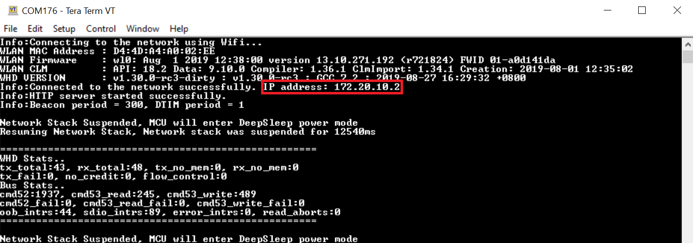
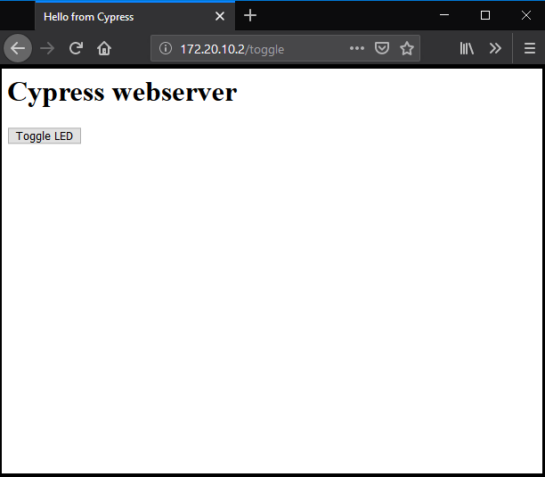
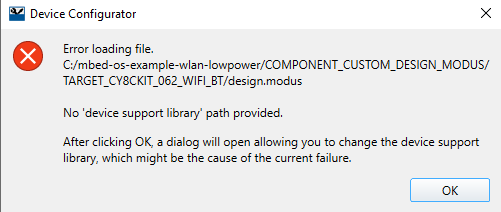
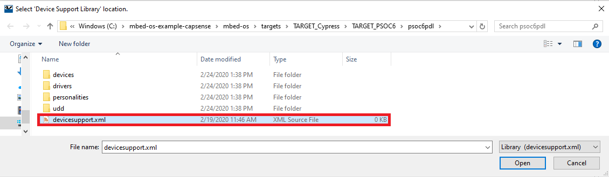
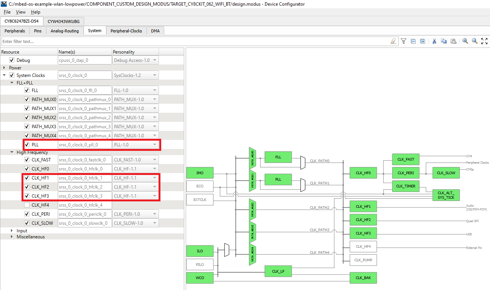
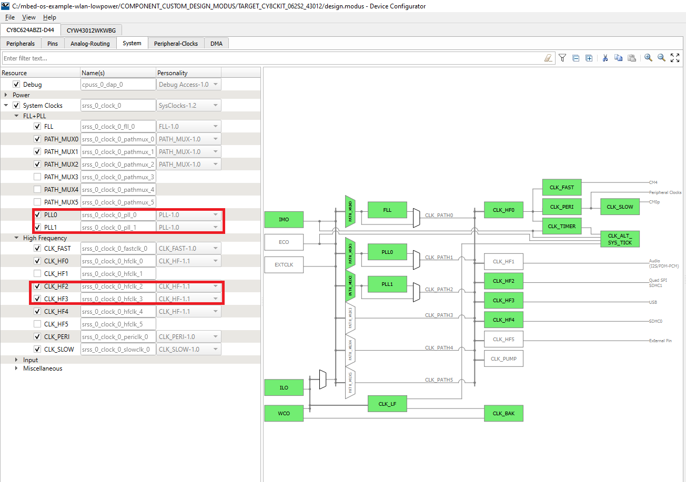
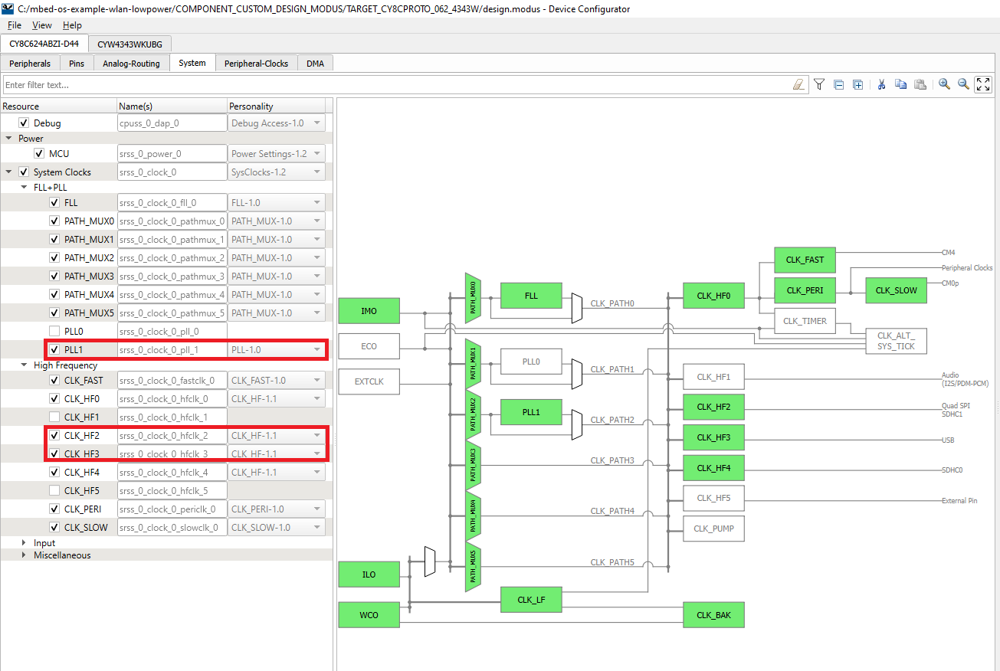
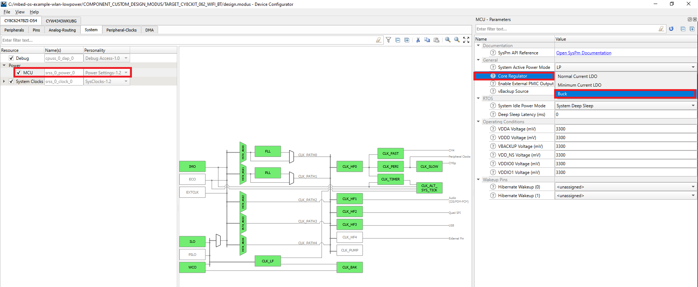

# Mbed OS Example: WLAN Low-Power

This code example demonstrates the low-power operation of a host MCU and a WLAN device using the network activity handlers provided by the [Low Power Assistant (LPA) middleware](https://github.com/cypresssemiconductorco/lpa).  

The example connects to a network whose credentials are provided in *mbed_app.json*. After connecting to the network successfully, the example starts an HTTP server. The example configures the WLAN device in the specified power save mode and sets the host MCU in an extended wait state, waiting for HTTP requests. The host MCU is in deep sleep or sleep mode while in the extended wait state.

Tested with Mbed OS v6.2.1

## Requirements

- [Mbed CLI](https://github.com/ARMmbed/mbed-cli)
- Programming Language: C/C++
- [ModusToolbox® software](https://www.cypress.com/products/modustoolbox-software-environment) v2.1
- Associated Parts: All [PSoC 6 MCU](http://www.cypress.com/PSoC6) parts

  **Note:** You do not need to install ModusToolbox to build and run this code example. However, installing it is required when you need to:

  * Debug using the Eclipse IDE for ModusToolbox. See the [user guide](https://www.cypress.com/MTBEclipseIDEUserGuide) for details.
  * Customize the default device configuration using any of the Configurator tools
  * Port this code example to a new target that is not listed under the [Supported Kits](#supported-kits-mbed-cli-argument---target)

## Supported Toolchains (Mbed CLI argument `--toolchain`)

- [GNU Arm® Embedded Compiler v9.2.1](https://developer.arm.com/open-source/gnu-toolchain/gnu-rm/downloads) (GCC_ARM)
- [Arm compiler v6.14](https://developer.arm.com/tools-and-software/embedded/arm-compiler/downloads/version-6) (ARM)

## Supported Kits (Mbed CLI argument `--target`)

- [PSoC 6 Wi-Fi BT Prototyping Kit](https://www.cypress.com/CY8CPROTO-062-4343W) (CY8CPROTO-062-4343W) - Default target
- [PSoC 62S2 Wi-Fi BT Pioneer Kit](https://www.cypress.com/CY8CKIT-062S2-43012) (CY8CKIT-062S2-43012)
- [PSoC 62 Wi-Fi BT Pioneer Kit](https://www.cypress.com/CY8CKIT-062-WIFI-BT) (CY8CKIT-062-WIFI-BT)
- [PSoC 62S3 Wi-Fi BT Prototyping Kit](https://www.cypress.com/CY8CPROTO-062S3-4343W) (CY8CPROTO-062S3-4343W)
- [PSoC 62S1 Wi-Fi BT Pioneer Kit](https://www.cypress.com/CYW9P62S1-43438EVB-01) (CYWP62S1-43438EVB-01)
- [PSoC 62S1 Wi-Fi BT Pioneer Kit](https://www.cypress.com/CYW9P62S1-43012EVB-01) (CYWP62S1-43012EVB-01)

## Hardware Setup

This example uses the board's default configuration. See the kit user guide to ensure that the board is configured correctly.

**Note:** The PSoC 6 BLE Pioneer Kit (CY8CKIT-062-BLE) and the PSoC 6 WiFi-BT Pioneer Kit (CY8CKIT-062-WIFI-BT) ship with KitProg2 installed. The ModusToolbox software requires KitProg3. Before using this code example, make sure that the board is upgraded to KitProg3. The tool and instructions are available in the [Firmware Loader](https://github.com/cypresssemiconductorco/Firmware-loader) GitHub repository. If you do not upgrade, you will see an error like "unable to find CMSIS-DAP device" or "KitProg firmware is out of date".

For Mbed OS, the kit must be in DAPLink mode. Refer the **KitProg3 User Guide** (found in the Documentation tab in the [Cypress Programming Solutions](https://www.cypress.com/products/psoc-programming-solutions) web page) for details of how to put the Pioneer Kit into DAPLink mode.

## Software Setup

Install a terminal emulator if you don't have one. Instructions in this document use [Tera Term](https://ttssh2.osdn.jp/index.html.en).

This example requires no additional software or tools.

## Import the Code Example Using Mbed CLI Tool

Mbed CLI commands are used to import the code example and compile. See [Working with Mbed CLI web page](https://os.mbed.com/docs/mbed-os/v6.2/tools/working-with-mbed-cli.html).

```
mbed import https://github.com/cypresssemiconductorco/mbed-os-example-wlan-lowpower
```

It first clones the code example repository from GitHub, and then deploys all the libraries. To perform the *deploy* process manually, use the following commands:

1. Clone the GitHub code example repository:

   ```
   git clone https://github.com/cypresssemiconductorco/mbed-os-example-wlan-lowpower && cd mbed-os-example-wlan-lowpower
   ```

2. Deploy the dependent libraries. The library files are identified with the *.lib* extension.

   ```
   mbed deploy
   ```

3. Set the current directory as *root*:

   ```
   mbed new .
   ```

## Operation
1. Connect the board to your PC using the provided USB cable through the KitProg3 USB connector.

2. Open *mbed_app.json* and edit the Wi-Fi SSID and password to match your AP settings.

3. Ensure that your computer is connected to the same Wi-Fi access point that you configured in Step 2.

4. Program the board.

   ```
   mbed compile -m <TARGET> -t <TOOLCHAIN> --flash --sterm
   ```
   For example, to build for the target `CY8CPROTO_062_4343W` with the `GCC_ARM` toolchain, use the following command:

   ```
   mbed compile -m CY8CPROTO_062_4343W -t GCC_ARM --flash --sterm
   ```

   **Note:** With the `--sterm` option, Mbed CLI opens a new  terminal with 9600-8N1 as the setting after programming completes. Do not use this option if you want to connect using another serial terminal application such as PuTTY or Tera Term.
   
   
5. After programming, the device connects to an access point (AP) and starts an HTTP server successfully, it displays the IP address of the device:

   **Figure 1. Serial Terminal Output**

   

6. Open a browser on a PC connected to the same network as the device.

7. Enter `http://<ip_address>/` in the search window to issue an HTTP GET request. The device responds by displaying a page with an option to toggle an LED. 

   **Figure 2. HTTP Server Webpage**

   

8. When you click the button, it sends an HTTP POST request to the device. The device toggles the state of the LED on receiving the HTTP POST request.

9. Alternatively, you can use `cURL` to issue HTTP requests. 

    - GET request:  

       ```
       curl -v -X GET "http://<ip_address>/"
       ```

    - POST request:

       ```
       curl -v -X POST "http:// <ip_address>/toggle/"
       ```

    **Note:** The host MCU will wake up on any network activity and not necessarily due to ping from the PC. The reasons for network activity could be due to the broadcast or multicast packets issued by the AP. Further power savings can be made by employing offload features like packet filtering, which will increase the time the host MCU will be in deep sleep. See [AN227910 - Low-Power System Design with CYW43012 and PSoC 6 MCU](https://www.cypress.com/documentation/application-notes/an227910-low-power-system-design-cyw43012-and-psoc-6-mcu) for more details.


## Debugging

You can debug the example to step through the code. In the IDE, use the **\<Application Name> Debug (KitProg3_MiniProg4)** configuration in the **Quick Panel**. For more details, see the "Program and Debug" section in the [Eclipse IDE for ModusToolbox User Guide](https://www.cypress.com/MTBEclipseIDEUserGuide).

Follow the steps from [Eclipse IDE for ModusToolbox User Guide](https://www.cypress.com/MTBEclipseIDEUserGuide#page=23) to export the Mbed OS code example and import it into Eclipse IDE for ModusToolbox for programming and debugging.

Mbed OS also supports debugging using any IDE that supports GDB. We recommend the user to go through [Arm Mbed documentation](https://os.mbed.com/docs/mbed-os/v6.2/debug-test/index.html) on the debugging steps.

**Note:** **(Only while debugging)** On the CM4 CPU, some code in `main()` may execute before the debugger halts at the beginning of `main()`. This means that some code executes twice - before the debugger stops execution, and again after the debugger resets the program counter to the beginning of `main()`. See [KBA231071](https://community.cypress.com/docs/DOC-21143) to learn about this and for the workaround.

## Measuring the Current

### CY8CKIT_062S2_43012, CYW9P62S1_43438EVB_01, and CYW9P62S1_43012EVB_01 

1. Measure the current for the PSoC 6 MCU device at J15 across VTARG and P6_VDD. Ensure that J25 is removed to eliminate leakage currents across  potentiometer R1.

2. For the CYW43xxx device, measure the current at VDDIO_WL used for the SDIO communication interface, and at VBAT used for powering the CYW43xxx device.

3. Measure the current for the CYW43xxx device at VBAT across VBAT and VCC_VBAT at J8.

4. Measure the current for the CYW43xxx device at VDDIO_WL across VDDIO_WL and VCC_VDDIO2 at J17.

**Note:** The level translator, U17, consumes approximately 110 uA and adds this leakage when measuring across VDDIO_WL. So, remove U17 which is on the back of the board below J3.1.

### CY8CPROTO_062_4343W

1. Measure the current for the PSoC 6 MCU device by removing R65 on the right of the board close to the USB connector of PSoC 6 MCU USB (device), and connecting an ammeter between VTARG (J2.32) and P6_VDD (J2.24).

   The PSoC 6 MCU deep sleep current is approximately 350 uA because of the pull-up resistor (R24) attached to WL_HOST_WAKE pin (P0_4), which leaks approximately 330 uA. This is because P0_4 is driven LOW when there is no network activity. Therefore, remove R24 at the back of the board below J1.9.

2. For the CYW4343W device, measure the current at VDDIO_1LV used for the SDIO communication interface, and at VBAT1 and VBAT2 used for powering CYW4343W. VBAT1 and VABT2 are shorted to each other. 

3. Measure the current at VBAT1 or VBAT2 by removing R87. R87 is on the back of the board, towards the right and above J2.33. Connect an ammeter between the pads of R87 to measure the current. 

4. Measure the current at VDDIO_1LV by removing the resistor R86, which is also on the back of the board, below J1.27. Connect an ammeter between the pads of R86 to measure the current. 

**Note:** The current at VDDIO_1LV will depend on the SDIO transactions that happen because of pull-up resistors on the SDIO lines to VDDIO_1LV. Also, VDDIO_1LV (named VDDIO_1DX in the carrier module CY8CMOD_062_4343W schematic) allows a current of 38 uA through R24 because WL_HOST_WAKE is LOW. Deduct this current from the observed value of VDDIO_1LV.

### CY8CPROTO_062S3_4343W

1. Measure the current for the PSoC 6 MCU device by removing R59 on the back of the board, towards the right and above J2.31, and connecting an ammeter between VTARG (J2.32) and P6_VDD (J2.31).

2. For the CYW4343W device, measure the current at VDDIO_1WL used for the SDIO communication interface, and at VBAT_WL used for powering CYW4343W.

3. Measure the current at VBAT_WL by removing R55. R55 is on the back of the board, towards the right and slightly above R59. Connect an ammeter between the pads of R55 to measure the current. 

4. Measure the current at VDDIO_WL by removing the resistor R71, which is also on the back of the board, next to R55. Connect an ammeter between the pads of R71 to measure the current. 


### CY8CKIT_062_WIFI_BT 
1. Measure the current for the PSoC 6 MCU device by connecting an ammeter to the PWR MON jumper J8.

2. For the CYW4343W device, measure the current at WL_VDDIO used for the SDIO communication interface, and at WL_VBAT used for powering CYW4343W. 

3. Measure the current at WL_VBAT by removing L3 along the right edge of the board close to the CYW4343W module, and connecting an ammeter between the pads of L3.

4. Measure the current at WL_VDDIO by removing L7 on the top left corner on the back of the board, and connecting an ammeter between the pads of L7.

## Design and Implementation

This application initiates a connection to an AP whose credentials are provided in *mbed_app.json*. After successfully connecting to an AP, the application starts an HTTP server. The IP address of the device is printed on the serial terminal. The HTTP port address used in this application is 80. The application responds to requests with URLs that are stored in a page database. On receiving an HTTP request with “/toggle” as a parameter, the device toggles the LED.

After starting the HTTP server, the host MCU suspends the network stack. Mbed OS uses the lightweight TCP/IP (lwIP) stack, which runs multiple network timers for various network-related activities. These timers need to be serviced by the host MCU. As a result, the host MCU will not be able to stay in sleep or deep sleep state for long. 

The example uses two macros, `INACTIVE_INTERVAL_MS` and `INACTIVE_WINDOW_MS`, to determine whether the network is inactive. The network is monitored for inactivity in an interval of length `INACTIVE_INTERVAL_MS`. If the network is inactive for a continuous duration specified by `INACTIVE_WINDOW_MS`, the network stack will be suspended until there is network activity.

The host MCU is alerted by the WLAN device on network activity after which the network stack is resumed. The host MCU is in deep sleep during the time the network stack is suspended. Because there are no network timers to be serviced, the host MCU will stay in deep sleep for longer. This state where the host MCU is in deep sleep waiting for network activity is referred to as "wait state".

In the wait state, if deep sleep is not locked, the Host MCU enters deep sleep; if not, it enters the sleep state. *mbedos sleep_manager* handles the sleep transition in the wait state.

On the other hand, the WLAN device is configured in one of the supported power-save modes:

1. **Power-save with Poll:** This mode corresponds to (legacy) 802.11 PS-Poll mode and should be used to achieve the lowest power consumption possible when the Wi-Fi device is primarily passively listening to the network.

2. **Power-save Without Poll:** This mode attempts to increase the throughput by waiting for a timeout period before returning to sleep rather than returning to sleep immediately.

The power-save mode can be set through the `WLAN_POWERSAVE_MODE` macro. The WLAN device wakes at every DTIM interval to receive beacon frames from the AP.

For more information on low-power system design that involves offloading tasks to the WLAN device for even better power savings, see [AN227910 - Low-Power System Design with CYW43012 and PSoC 6 MCU](https://www.cypress.com/documentation/application-notes/an227910-low-power-system-design-cyw43012-and-psoc-6-mcu).

**Note:** If the device disconnects from the AP, it will stay in low-power mode forever, necessitating a device reset to connect again to the AP.

### Creating Custom Device Configuration for Low-Power

The code example overrides the default device configuration provided in *<application_folder>/mbed-os/targets/TARGET_Cypress/TARGET_PSOC6/TARGET_\<kit>/COMPONENT_BSP_DESIGN_MODUS* with the one provided in *<application_folder>/COMPONENT_CUSTOM_DESIGN_MODUS/TARGET_\<kit>* for the supported kits.  

The custom configuration disables the Phase-Locked Loop (PLL), and disables the HF clock for unused peripherals like audio/USB, and configures the Buck regulator instead of the Low Dropout (LDO) regulator to power the PSoC 6 MCU device. This configuration reduces the current consumed by the PSoC 6 MCU device in active state.  

If your application uses any of the disabled peripherals, the corresponding peripherals and clocks should be enabled using the Device Configurator. The Device Configurator is bundled with the ModusToolbox installation and can be found at *\<ModusToolbox_installed_location>/tools_\*.\*/device-configurator*.

Do the following to create a custom configuration for a new kit:

1. Create a new directory inside *COMPONENT_CUSTOM_DESIGN_MODUS* with the same name as the target you are building the example for, such as *<application_folder>/COMPONENT_CUSTOM_DESIGN_MODUS/TARGET_\<kit>*.

2. Copy the contents of the *COMPONENT_BSP_DESIGN_MODUS* folder at *<application_folder>/mbed-os/targets/TARGET_Cypress/TARGET_PSOC6/TARGET_\<kit>/COMPONENT_BSP_DESIGN_MODUS* into the folder created in the previous step except the *GeneratedSource* folder.  

   **Note:** The files *design.cycapsense* and *design.qspi* are copied so that you don't have to configure these peripherals again. You only need to enable these peripherals in the *design.modus* file to use them.  

3. Open the copied *design.modus* file using Device Configurator. You will be prompted to provide a path to the device support library as shown below:

   **Figure 3. Prompt for Device Support Library Path**

   

4.  Click **OK** and provide the path to the device support library in *mbed-os/targets/TARGET_Cypress/TARGET_PSOC6/psoc6pdl/devicesupport.xml* as shown below:

    **Figure 4. Select devicesupport.xml**

    

5. Switch to the **System** tab and expand the **System Clocks** resource. Disable the PLL by clearing the box in the **FLL+PLL** section. In the **High Frequency** section, disable HF clocks to the peripherals that are not being used in the example.

    **CY8CKIT_062_WIFI_BT**

    PLL and High Frequency Clocks (CLK_HF1, CLK_HF2, and CLK_HF3) are disabled in this example for CY8CKIT_062_WIFI_BT as shown below:

    **Figure 5. Clock settings in CY8CKIT-062-WIFI-BT**

    

    **CY8CKIT_062S2_43012**

    PLL0 and PLL1, and High Frequency Clocks (CLK_HF2 and CLK_HF3) are disabled in this example for CY8CKIT_062S2_43012 as shown below:

    **Figure 6. Clock Settings in CY8CKIT-062S2-43012**

    

    **CY8CPROTO_062_4343W**

    PLL1 and High Frequency Clocks (CLK_HF2 and CLK_HF3) are disabled in this example for CY8CPROTO_062_4343W as shown below:

    **Figure 7. Clock settings in CY8CPROTO-062-4343W**

    

4. Under the **Power** resource, change the **Core Regulator** under **General** to **Buck** as shown below:

    **Figure 8. Configuring Core Regulator as Buck**

    

**Note:** If you save the configuration with the CapSense® peripheral enabled, the configurator generates source files that include a header file that is part of the CapSense middleware, without which you will see errors when compiling. Therefore, you should either disable the CapSense peripheral or download the [CapSense middleware](https://github.com/cypresssemiconductorco/middleware-capsense).

5. Save the file to generate the source files.

6. Disable the default configuration in *<application_folder>/mbed-os/targets/TARGET_Cypress/TARGET_PSOC6/TARGET_\<kit>/COMPONENT_BSP_DESIGN_MODUS* and enable the custom configuration in *<application_folder>/COMPONENT_CUSTOM_DESIGN_MODUS/TARGET_\<kit>* by making the following changes in *mbed_app.json*:
   ```
   "<kit>": {
   "target.components_remove": ["BSP_DESIGN_MODUS"],
   "target.components_add":["CUSTOM_DESIGN_MODUS"],
   "target.macros_add":["USER_LED=CYBSP_USER_LED]
   }
   ```
   **Note:** See the schematic to find the LED which is not powered directly by P6_VDD. If the LED is directly connected to P6_VDD, the current consumed by the LED will be added to the current measurement of the PSoC 6 MCU device. Find the corresponding macro for that LED in *cybsp_types.h* at *<application_folder>/mbed-os/targets/TARGET_Cypress/TARGET_PSOC6/TARGET_\<kit>/cybsp_types.h*. Provide that macro as the value for `USER_LED` in *mbed_app.json*.

### Typical Current Measurement Values

Table 1 through Table 3 show the typical current measurement values for each kit. All measurements were made in the presence of external radio interference and not in an isolated environment with a single AP. Note that the typical values of current consumed by the supply powering the SDIO interface between the host MCU and WLAN device is not provided because the value of current varies with the transaction over the interface.

Table 1 lists the typical current values expected, for CY8CKIT_062S2_43012, when the PSoC 6 MCU device is operated with Arm® Cortex®-M4 running at 100 MHz and at 1.1 V with full RAM retention.

**Table 1. Typical Current Values for CY8CKIT_062S2_43012**

<table style="width:100%"> 
<tr><th>State</th><th>Device</th><th>Current</th></tr>
        <tr>
            <td rowspan=2>Deep sleep</td>
            <td>PSoC 6 MCU</td>
            <td>26.5 uA</td>
        </tr>
        <tr>
            <td>CYW43012</td>
            <td>VBAT <br> 2.53 uA</td>
        </tr>
        <tr>
            <td rowspan=2>Average current over 3 DTIM Periods for<br>AP(2.4 GHz) Beacon Interval of 100 and<br>AP DTIM of 1 and no HTTP activity</td>
            <td>PSoC 6 MCU</td>
            <td>26.5 uA</td>
        </tr>
        <tr>
            <td>CYW43012</td>
            <td>VBAT <br> Min: 435 uA, Max: 510 uA</td>
        </tr>
        <tr>
            <td rowspan=2>Average current over 3 DTIM Periods for<br>AP (2.4 GHz) Beacon Interval of 100 and<br>AP DTIM of 3 and no HTTP activity</td>
            <td>PSoC 6 MCU</td>
            <td>26.5 uA</td>
        </tr>
        <tr>
            <td>CYW43012</td>
            <td>VBAT <br> Min: 115 uA, Max: 310 uA</td>
        </tr>
        <tr>
            <td rowspan=2>Average current over 3 DTIM Periods for<br>AP (5 GHz) Beacon Interval of 100 and<br>AP DTIM of 1 and no HTTP activity</td>
            <td>PSoC 6 MCU</td>
            <td>26.5 uA</td>
        </tr>
        <tr>
            <td>CYW43012</td>
            <td>VBAT <br> Min: 254 uA, Max: 280 uA</td>
        </tr>
        <tr>
            <td rowspan=2>Average current over 3 DTIM Periods for<br>AP (5 GHz) Beacon Interval of 100 and<br> AP DTIM of 3 and no HTTP activity</td>
            <td>PSoC 6 MCU</td>
            <td>26.5 uA</td>
        </tr>
        <tr>
            <td>CYW43012</td>
            <td>VBAT <br> Min: 67 uA, Max: 120 uA</td>
        </tr>        
 </table> 

Table 2 lists the typical current values expected, for CY8CPROTO_062_4343W, when the PSoC 6 MCU device is operated with CM4 running at 100 MHz, 1.1 V with full RAM retention.

**Table 2. Typical Current Values for CY8CPROTO_062_4343W**

<table style="width:100%"> 
<tr><th>State</th><th>Device</th><th>Current</th></tr>
        <tr>
            <td rowspan=2>Deep sleep</td>
            <td>PSoC 6 MCU</td>
            <td>28 uA</td>
        </tr>
        <tr>
            <td>CYW4343W</td>
            <td>VBAT1/VBAT2 <br> 5 uA</td>
        </tr>
        <tr>
            <td rowspan=2>Average current over 1 sec for<br> AP Beacon Interval of 100 and <br>AP DTIM of 1 and no HTTP activity</td>
            <td>PSoC 6 MCU</td>
            <td>28 uA</td>
        </tr>
        <tr>
            <td>CYW4343W</td>
            <td>VBAT1/VBAT2 <br> Min: 1.3 mA, Max: 1.5 mA</td>
        </tr>
        <tr>
            <td rowspan=2>Average current over 1 sec for<br> AP Beacon Interval of 300 and<br> AP DTIM of 3 and no HTTP activity</td>
            <td>PSoC 6 MCU</td>
            <td>28 uA</td>
        </tr>
        <tr>
            <td>CYW4343W</td>
            <td>VBAT1/VBAT2 <br> Min: 280 uA, Max: 315 uA</td>
        </tr>

 </table>     

  Table 3 lists the typical current values expected, for CY8CKIT_062_WIFI_BT, when the PSoC 6 MCU device is operated with CM4 running at 100 MHz, 1.1 V with full RAM retention. Note that the current for CYW4343W is measured at WL_VBAT, which is also powering the oscillator that provides clock to CYW4343W, resulting in higher values of current measurements.

**Table 3. Typical Current Values for CY8CKIT_062_WIFI_BT**

<table style="width:100%"> 
<tr><th>State</th><th>Device</th><th>Current</th></tr>
        <tr>
            <td rowspan=2>Deep sleep</td>
            <td>PSoC 6 MCU</td>
            <td>18 uA</td>
        </tr>
        <tr>
            <td>CYW4343W</td>
            <td>WL_VBAT <br> 75 uA</td>
        </tr>
        <tr>
            <td rowspan=2>Average current over 1 sec for<br>AP Beacon Interval of 100 and<br> AP DTIM of 1 and no HTTP activity</td>
            <td>PSoC 6 MCU</td>
            <td>18 uA</td>
        </tr>
        <tr>
            <td>CYW4343W</td>
            <td>WL_VBAT <br> Min: 1.3 mA, Max: 1.5 mA</td>
        </tr>
        <tr>
            <td rowspan=2>Average current over 1 sec for<br> AP Beacon Interval of 300 and<br> AP DTIM of 3 and no HTTP activity</td>
            <td>PSoC 6 MCU</td>
            <td>18 uA</td>
        </tr>
        <tr>
            <td>CYW4343W</td>
            <td>WL_VBAT <br> Min: 360 uA, Max: 416 uA</td>
        </tr>

 </table>
    


### Related Resources

| Application Notes                                            |                                                              |
| :----------------------------------------------------------- | :----------------------------------------------------------- |
| [AN228571](https://www.cypress.com/AN228571) – Getting Started with PSoC 6 MCU on ModusToolbox | Describes PSoC 6 MCU devices and how to build your first application with ModusToolbox |
| [AN221774](https://www.cypress.com/AN221774) – Getting Started with PSoC 6 MCU on PSoC Creator | Describes PSoC 6 MCU devices and how to build your first application with PSoC Creator |
| [AN210781](https://www.cypress.com/AN210781) – Getting Started with PSoC 6 MCU with Bluetooth Low Energy (BLE) Connectivity on PSoC Creator | Describes PSoC 6 MCU with BLE Connectivity devices and how to build your first application with PSoC Creator |
| [AN215656](https://www.cypress.com/AN215656) – PSoC 6 MCU: Dual-CPU System Design | Describes the dual-CPU architecture in PSoC 6 MCU, and shows how to build a simple dual-CPU design |
| **Code Examples**                                            |                                                              |
| [Using ModusToolbox](https://github.com/cypresssemiconductorco/Code-Examples-for-ModusToolbox-Software) | [Using PSoC Creator](https://www.cypress.com/documentation/code-examples/psoc-6-mcu-code-examples) |
| **Device Documentation**                                     |                                                              |
| [PSoC 6 MCU Datasheets](https://www.cypress.com/search/all?f[0]=meta_type%3Atechnical_documents&f[1]=resource_meta_type%3A575&f[2]=field_related_products%3A114026) | [PSoC 6 Technical Reference Manuals](https://www.cypress.com/search/all/PSoC%206%20Technical%20Reference%20Manual?f[0]=meta_type%3Atechnical_documents&f[1]=resource_meta_type%3A583) |
| **Development Kits**                                         | Buy at www.cypress.com                                       |
| [CY8CKIT-062-BLE](https://www.cypress.com/CY8CKIT-062-BLE) PSoC 6 BLE Pioneer Kit | [CY8CKIT-062-WiFi-BT](https://www.cypress.com/CY8CKIT-062-WiFi-BT) PSoC 6 WiFi-BT Pioneer Kit |
| [CY8CPROTO-063-BLE](https://www.cypress.com/CY8CPROTO-063-BLE) PSoC 6 BLE Prototyping Kit | [CY8CPROTO-062-4343W](https://www.cypress.com/CY8CPROTO-062-4343W) PSoC 6 Wi-Fi BT Prototyping Kit |
| [CY8CKIT-062S2-43012](https://www.cypress.com/CY8CKIT-062S2-43012) PSoC 62S2 Wi-Fi BT Pioneer Kit | [CY8CPROTO-062S3-4343W](https://www.cypress.com/CY8CPROTO-062S3-4343W) PSoC 62S3 Wi-Fi BT Prototyping Kit |
| [CYW9P62S1-43438EVB-01](https://www.cypress.com/CYW9P62S1-43438EVB-01) PSoC 62S1 Wi-Fi BT Pioneer Kit | [CYW9P62S1-43012EVB-01](https://www.cypress.com/CYW9P62S1-43012EVB-01) PSoC 62S1 Wi-Fi BT Pioneer Kit |                                                              |
| **Libraries**                                                 |                                                              |
| PSoC 6 Peripheral Driver Library (PDL) and docs                    | [psoc6pdl](https://github.com/cypresssemiconductorco/psoc6pdl) on GitHub |
| Cypress Hardware Abstraction Layer (HAL) Library and docs          | [psoc6hal](https://github.com/cypresssemiconductorco/psoc6hal) on GitHub |
| RetargetIO - A utility library to retarget the standard input/output (STDIO) messages to a UART port | [retarget-io](https://github.com/cypresssemiconductorco/retarget-io) on GitHub |
| **Middleware**                                               |                                                              |
| Low Power Assistant (LPA)                    | [lpa](https://github.com/cypresssemiconductorco/lpa) on GitHub |
| HTTP Server                                    | [http-server](https://github.com/cypresssemiconductorco/http-server) on GitHub |
| Connectivity-Utilities                                    | [connectivity-utilities](https://github.com/cypresssemiconductorco/connectivity-utilities) on GitHub |
| Links to all PSoC 6 MCU Middleware                           | [psoc6-middleware](https://github.com/cypresssemiconductorco/psoc6-middleware) on GitHub |
| **Tools**                                                    |                                                              |
| [Eclipse IDE for ModusToolbox](https://www.cypress.com/modustoolbox)     | The cross-platform, Eclipse-based IDE for IoT designers that supports application configuration and development targeting converged MCU and wireless systems.             |
| [PSoC Creator](https://www.cypress.com/products/psoc-creator-integrated-design-environment-ide) | The Cypress IDE for PSoC and FM0+ MCU development.            |

#### Other Resources

Cypress provides a wealth of data at www.cypress.com to help you to select the right device, and quickly and effectively integrate the device into your design.

For the PSoC 6 MCU devices, see [KBA223067](https://community.cypress.com/docs/DOC-14644) in the Cypress community for a comprehensive list of PSoC 6 MCU resources.

## Document History

Document Title: *CE229150 - Mbed OS Example: WLAN Low-Power*

| Revision | Description of Change                                        |
| -------- | ------------------------------------------------------------ |
| 1.0.0   | New code example<br />Tested with Mbed OS v5.14.2 and LPA Middleware v1.0.0 |
| 2.0.0   | Modified folder structure, updated to latest libraries, changes to code, and readme changes|
------

All other trademarks or registered trademarks referenced herein are the property of their respective owners.


-------------------------------------------------------------------------------

© Cypress Semiconductor Corporation, 2020. This document is the property of Cypress Semiconductor Corporation and its subsidiaries ("Cypress"). This document, including any software or firmware included or referenced in this document ("Software"), is owned by Cypress under the intellectual property laws and treaties of the United States and other countries worldwide. Cypress reserves all rights under such laws and treaties and does not, except as specifically stated in this paragraph, grant any license under its patents, copyrights, trademarks, or other intellectual property rights. If the Software is not accompanied by a license agreement and you do not otherwise have a written agreement with Cypress governing the use of the Software, then Cypress hereby grants you a personal, non-exclusive, nontransferable license (without the right to sublicense) (1) under its copyright rights in the Software (a) for Software provided in source code form, to modify and reproduce the Software solely for use with Cypress hardware products, only internally within your organization, and (b) to distribute the Software in binary code form externally to end users (either directly or indirectly through resellers and distributors), solely for use on Cypress hardware product units, and (2) under those claims of Cypress's patents that are infringed by the Software (as provided by Cypress, unmodified) to make, use, distribute, and import the Software solely for use with Cypress hardware products. Any other use, reproduction, modification, translation, or compilation of the Software is prohibited.  
TO THE EXTENT PERMITTED BY APPLICABLE LAW, CYPRESS MAKES NO WARRANTY OF ANY KIND, EXPRESS OR IMPLIED, WITH REGARD TO THIS DOCUMENT OR ANY SOFTWARE OR ACCOMPANYING HARDWARE, INCLUDING, BUT NOT LIMITED TO, THE IMPLIED WARRANTIES OF MERCHANTABILITY AND FITNESS FOR A PARTICULAR PURPOSE. No computing device can be absolutely secure. Therefore, despite security measures implemented in Cypress hardware or software products, Cypress shall have no liability arising out of any security breach, such as unauthorized access to or use of a Cypress product. CYPRESS DOES NOT REPRESENT, WARRANT, OR GUARANTEE THAT CYPRESS PRODUCTS, OR SYSTEMS CREATED USING CYPRESS PRODUCTS, WILL BE FREE FROM CORRUPTION, ATTACK, VIRUSES, INTERFERENCE, HACKING, DATA LOSS OR THEFT, OR OTHER SECURITY INTRUSION (collectively, "Security Breach"). Cypress disclaims any liability relating to any Security Breach, and you shall and hereby do release Cypress from any claim, damage, or other liability arising from any Security Breach. In addition, the products described in these materials may contain design defects or errors known as errata which may cause the product to deviate from published specifications. To the extent permitted by applicable law, Cypress reserves the right to make changes to this document without further notice. Cypress does not assume any liability arising out of the application or use of any product or circuit described in this document. Any information provided in this document, including any sample design information or programming code, is provided only for reference purposes. It is the responsibility of the user of this document to properly design, program, and test the functionality and safety of any application made of this information and any resulting product. "High-Risk Device" means any device or system whose failure could cause personal injury, death, or property damage. Examples of High-Risk Devices are weapons, nuclear installations, surgical implants, and other medical devices. "Critical Component" means any component of a High-Risk Device whose failure to perform can be reasonably expected to cause, directly or indirectly, the failure of the High-Risk Device, or to affect its safety or effectiveness. Cypress is not liable, in whole or in part, and you shall and hereby do release Cypress from any claim, damage, or other liability arising from any use of a Cypress product as a Critical Component in a High-Risk Device. You shall indemnify and hold Cypress, its directors, officers, employees, agents, affiliates, distributors, and assigns harmless from and against all claims, costs, damages, and expenses, arising out of any claim, including claims for product liability, personal injury or death, or property damage arising from any use of a Cypress product as a Critical Component in a High-Risk Device. Cypress products are not intended or authorized for use as a Critical Component in any High-Risk Device except to the limited extent that (i) Cypress's published data sheet for the product explicitly states Cypress has qualified the product for use in a specific High-Risk Device, or (ii) Cypress has given you advance written authorization to use the product as a Critical Component in the specific High-Risk Device and you have signed a separate indemnification agreement.  
Cypress, the Cypress logo, Spansion, the Spansion logo, and combinations thereof, WICED, PSoC, CapSense, EZ-USB, F-RAM, and Traveo are trademarks or registered trademarks of Cypress in the United States and other countries. For a more complete list of Cypress trademarks, visit cypress.com. Other names and brands may be claimed as property of their respective owners.
